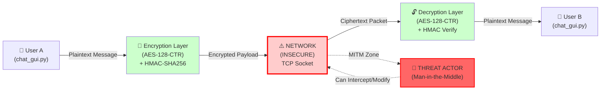

# SecMsg - Secure P2P Messaging Protocol

A cryptographically-secured peer-to-peer messaging system that enables secure, authenticated communication between two peers over a network. This project implements a custom protocol with end-to-end encryption, message authentication, and perfect forward secrecy.

## Features

- **End-to-End Encryption**: All messages encrypted with AES-128-CTR mode
- **Message Authentication**: HMAC-SHA256 ensures message integrity and authenticity
- **Secure Key Exchange**: Diffie-Hellman (2048-bit MODP Group 14) for establishing shared secrets
- **Multi-Peer Support**: Handles multiple concurrent peer connections
- **GUI Application**: Tkinter-based secure chat interface with protocol inspection
- **Protocol Transparency**: Detailed packet inspection for debugging and verification
- **Custom Crypto Implementation**: Educational implementations of cryptographic primitives

## Project Structure

```
SecMsg/
├── chat_gui.py                          # Tkinter GUI application for secure chat
├── peer/
│   └── peer.py                          # Core peer networking and protocol handling
├── protocol/
│   └── v0_1.py                          # SegMessage protocol definition
├── AES/
│   └── AES.py                           # AES-128 encryption with CTR mode
├── Diffie_Hellman/
│   └── DH.py                            # Diffie-Hellman key exchange
├── HMAC/
│   ├── HMAC.py                          # HMAC-SHA256 implementation
│   └── hmac_key_generation.py           # HKDF key derivation
└── key_local_storage/                   # Local storage for key material
    ├── peer1.txt
    └── peer2.txt
```

## Technologies Used

- **Language**: Python 3
- **Cryptography**:
  - AES-128-CTR (symmetric encryption)
  - HMAC-SHA256 (message authentication)
  - Diffie-Hellman Key Exchange (asymmetric key agreement)
- **GUI Framework**: Tkinter
- **Networking**: Python socket library
- **Architecture**: Multi-threaded peer-to-peer model

## How It Works

### 1. Key Exchange (Handshake Phase)
- Peer A connects to Peer B
- Both peers generate Diffie-Hellman private keys
- Public keys are exchanged via `HANDSHAKE_REQUEST` and `HANDSHAKE_RESPONSE` messages
- Shared secret is calculated using Diffie-Hellman key agreement
- AES key is derived from the shared secret
- HMAC key is derived using HKDF (HMAC-based Key Derivation Function)

### 2. Message Exchange
- Messages are encrypted using AES-128-CTR mode
- HMAC-SHA256 is computed over the complete message for authentication
- Timestamps are included for data freshness
- Messages are transmitted with protocol headers and payload validation

### 3. Protocol Structure
Each message contains:
- Protocol ID and Message Type
- Payload length and original hash
- Timestamp
- Encrypted payload (AES-CTR)
- HMAC-SHA256 authentication tag

## Getting Started

### Requirements
- Python 3.x
- No external dependencies (all cryptographic implementations are included)

### Installation

1. Clone the repository:
```bash
git clone <repository-url>
cd SecMsg
```

2. Run the GUI application:
```bash
python chat_gui.py
```

## Usage

### GUI Application

1. **Start the Application**: Run `python chat_gui.py`
2. **Configure Server**: Set the listening port (default: 5000)
3. **Connect to Peer**: Enter the peer's IP address and port, then click "Connect"
4. **Send Messages**: Type your message and press "Send" to encrypt and transmit
5. **Monitor Protocol**: View detailed packet inspection including encryption status and HMAC validation

### Message Types

- **HANDSHAKE_REQUEST (0x02)**: Initiates key exchange with public key
- **HANDSHAKE_RESPONSE (0x03)**: Responds to key exchange with public key
- **REGULAR_MESSAGE (0x01)**: Encrypted chat message with authentication

## Security Considerations

### Strengths
- **Perfect Forward Secrecy**: Ephemeral DH key exchange ensures old sessions cannot be decrypted
- **Authenticated Encryption**: HMAC-SHA256 prevents message tampering
- **Strong Symmetric Encryption**: AES-128-CTR mode provides confidentiality
- **2048-bit DH**: Cryptographically strong key exchange parameter

### Educational Focus
This project is designed for learning cryptography and secure network programming concepts. While the implementations are functionally correct, for production use consider:
- Using established cryptographic libraries (cryptography, PyCryptodome)
- Implementing additional security features (perfect forward secrecy per-message, replay attack prevention)
- Security audits and formal verification

## Architecture Overview

```
┌─────────────────┐           Network           ┌─────────────────┐
│   Peer A        │ ◄──────────────────────────► │   Peer B        │
│  (chat_gui.py)  │                              │  (chat_gui.py)  │
└────────┬────────┘                              └────────┬────────┘
         │                                                 │
         │                                                 │
    ┌────▼─────────────────────────────────────────────────▼─────┐
    │  Protocol Layer (v0_1.py)                                   │
    │  - Message serialization/deserialization                    │
    │  - Protocol validation                                      │
    └────┬─────────────────────────────────────────────────┬──────┘
         │                                                 │
    ┌────▼──────────────┐                          ┌──────▼────────┐
    │ Encryption Layer  │                          │ Encryption    │
    │ ┌──────────────┐  │                          │ Layer         │
    │ │ AES-128-CTR  │  │                          │ ┌──────────┐  │
    │ │ HMAC-SHA256  │  │                          │ │ AES-CTR  │  │
    │ └──────────────┘  │                          │ │ HMAC-SHA │  │
    └────┬──────────────┘                          └──────┬────────┘
         │                                                 │
    ┌────▼──────────────┐                          ┌──────▼────────┐
    │ Key Exchange (DH) │                          │ Key Exchange  │
    │ Shared Secret     │                          │ Shared Secret │
    └───────────────────┘                          └───────────────┘
```

## File Descriptions

| File | Purpose |
|------|---------|
| `chat_gui.py` | Main GUI application - handles user interface and peer connections |
| `peer/peer.py` | Core networking logic - socket management and protocol handling |
| `protocol/v0_1.py` | Protocol definition - message types and packet structure |
| `AES/AES.py` | AES-128 implementation with ECB and CTR modes |
| `Diffie_Hellman/DH.py` | Diffie-Hellman key exchange implementation |
| `HMAC/HMAC.py` | HMAC-SHA256 implementation (RFC 2104) |
| `HMAC/hmac_key_generation.py` | HKDF-based key derivation |

## Contributing

Contributions are welcome! Please feel free to:
- Report bugs and security issues
- Suggest improvements
- Submit pull requests with enhancements

## License

[Specify your license here]

## Disclaimer

This is an educational project created to demonstrate cryptographic concepts and secure peer-to-peer communication. While the implementations are correct, this is not recommended for production use in security-critical applications without professional security review.

## Author

[Your name/team]

## Mô Hình Đe Dọa & Đánh Giá Bảo Mật (Threat Model & Security Assessment)

### I. Tổng Quan Hệ Thống (System Overview)

SecMsg v0.1 sử dụng các nguyên thủy mã hóa sau đây:

| Thành phần | Công nghệ | Kích thước |
|-----------|-----------|----------|
| **Key Exchange** | Diffie-Hellman | 2048-bit (MODP Group 14) |
| **Symmetric Encryption** | AES-128-CTR | 128-bit key |
| **Authentication** | HMAC-SHA256 | 256-bit |
| **Key Derivation** | HKDF | SHA-256 based |

**Lưu ý quan trọng**: Mặc dù các thuật toán được sử dụng là mạnh về lý thuyết, nhưng việc triển khai trong SecMsg v0.1 chứa các **lỗ hổng bảo mật CRITICAL** trong xử lý nonce và xác thực handshake.

---

### II. Sơ Đồ Luồng Dữ Liệu (Data Flow Diagram)



**Trust Boundary**: Mạng (Network) - Tất cả các packet truyền qua TCP Socket đều có thể bị chặn, sửa đổi hoặc giả mạo.

---

### III. Phân Tích STRIDE Chi Tiết

#### **S - Spoofing (Giả Mạo Danh Tính)**

**Mức độ**: 🔴 **CRITICAL** - **ĐỀ NGHỊ: PHẢI SỬA**

**Mô tả lỗ hổng**:

Quá trình handshake Diffie-Hellman không có cơ chế xác thực. Hai peer chỉ trao đổi công khai khóa **mà không có bất kỳ chữ ký số (RSA, ECDSA)** nào để xác minh danh tính.

**Tấn công Man-in-the-Middle (MITM)**:

```
Tình huống bình thường:
  Peer A ----DH_pubkey_A----> Peer B
         <----DH_pubkey_B----

Tấn công MITM:
  Peer A ----DH_pubkey_A----> 🚨 Attacker 🚨 <-------- Peer B
           <---DH_pubkey_M----  (intercept)  ----DH_pubkey_M------>

  Attacker tạo 2 shared secret:
  - shared_secret_A = DH(privkey_M, pubkey_A)
  - shared_secret_B = DH(privkey_M, pubkey_B)

  ✅ Attacker giờ có thể:
     1. Decrypted mọi tin nhắn từ Peer A
     2. Forwarded đến Peer B (hoặc sửa đổi)
     3. Decrypt tin từ Peer B
     4. Forwarded về Peer A
     5. Cả hai peers đều tin rằng họ đang nói chuyện với nhau!
```

**Mã nguồn dễ bị tấn công** (peer.py, dòng 126-160):

```python
# ❌ KHÔNG CÓ XÁC MINH CHỉ ĐỌC CÔNG KHAI KHÓ!
elif msg.message_type == MessageType.HANDSHAKE_REQUEST:
    peer_pk = int.from_bytes(msg.payload, 'big')  # Nhận công khai khóa mà không xác minh
    state['peer_public_key'] = peer_pk
    shared_secret_int = DH.calculate_shared_secret(peer_pk, state['my_private_key'])
    # ... không có validate/signature check
```

**Tác động**:
- ❌ Mất bí mật hoàn toàn (Confidentiality Loss)
- ❌ Mất tính toàn vẹn (Integrity Loss via MITM)
- ⚠️ Không tuân thủ PFS (Perfect Forward Secrecy) - vì không có xác thực

---

#### **T - Tampering (Sửa Đổi Dữ Liệu)**

**Mức độ**: 🟡 **HIGH** - **Phụ thuộc vào Spoofing**

**Phân tích**:

Nếu không có tấn công MITM (Spoofing), HMAC-SHA256 cung cấp bảo vệ tốt chống tampering:
- Bất kỳ sửa đổi nào trên ciphertext sẽ làm HMAC không hợp lệ
- Peer sẽ phát hiện và từ chối packet (peer.py dòng 114-123)

**Nhưng**, nếu xảy ra MITM (Spoofing thành công):
- Attacker biết cả shared_secret
- Attacker có thể tính toán HMAC đúng cho các tin nhắn giả mạo
- ❌ HMAC trở thành vô dụng

**Mã nguồn**:

```python
# ✅ Có xác minh HMAC
if msg.message_type == MessageType.REGULAR_MESSAGE:
    text = msg.payload.decode('utf-8')
    self.emit("MSG", idx, f"[Peer]: {text}")
    # Nhưng khóa được lấy từ handshake không xác thực (Spoofing đã xảy ra)
```

---

#### **R - Repudiation (Tuyên Bố Không Gửi / Phủ Nhận Trách Nhiệm)**

**Mức độ**: 🟡 **MEDIUM** - **Thiết kế cơ bản**

**Mô tả lỗ hổng**:

SecMsg sử dụng **HMAC-SHA256** (mã xác thực **đối xứng**):
- Cả hai Peer đều có chung khóa HMAC
- Bất kỳ ai có khóa HMAC đều có thể **tạo HMAC có hiệu lực cho bất kỳ tin nhắn nào**

**Tấn công Repudiation**:

```
Scenario:
  - Alice và Bob chia sẻ shared_secret (vì lẽ DH handshake)
  - Alice gửi: "Tôi chấp thuận hợp đồng"
  - HMAC được tính: HMAC = SHA256(key, message)

  Nếu xảy ra tranh chấp:
  - Alice có thể phủ nhận: "Tôi không gửi tin này!"
  - Bob không có cách nào chứng minh (tiếp cận pháp lý) vì:
    * Alice biết khóa HMAC (vì đó là shared secret)
    * Alice có thể tự tạo HMAC giống hệt
    * Không có chữ ký số (RSA) từ private key của Alice
```

**So sánh với Digital Signatures**:

```
HMAC (❌ Đối xứng):
  Both A & B: HMAC_key = SHA256(shared_secret)
  Cả hai có thể tạo HMAC → Phủ nhận có thể

RSA Signatures (✅ Bất đối xứng):
  Alice có: private_key_A (chỉ Alice biết)
  Bob có: public_key_A (công khai)
  Alice ký: signature = RSA_sign(private_key_A, message)
  Bob xác minh: RSA_verify(public_key_A, signature, message)
  → Chỉ Alice có thể tạo signature → Phủ nhận không thể
```

---

#### **I - Information Disclosure (Tiết Lộ Thông Tin)**

**Mức độ**: 🔴 **CRITICAL** - **LỖI THIẾT KẾ MÃ HÓA**

**Lỗ hổng Nonce Reuse trong AES-CTR**:

AES.py, dòng 180:

```python
# ❌ CRITICAL: Nonce cứng và tái sử dụng
nonce = b"\x00"*8  # Nonce LUÔN LUÔN là 8 bytes all-zero!

def ctr_encrypt(key16, nonce8, plaintext):
    # ...
    for i in range(0, len(plaintext), 16):
        block = plaintext[i:i+16]
        ctr_block = nonce8 + pack(">Q", counter)  # nonce8 LẶP LẠI MỖI PEERING
        keystream = encrypt_block(ctr_block, round_keys)
        out.extend(bytes(a ^ b for a,b in zip(block, keystream[:len(block)])))
```

**Tác động của Nonce Reuse**:

CTR mode hoạt động bằng cách:
```
C = P ⊕ E(K, nonce || counter)

Nếu sử dụng lại (K, nonce):
  C1 = P1 ⊕ E(K, nonce || 0)
  C2 = P2 ⊕ E(K, nonce || 0)  ← KEYSTREAM GIỐNG (nonce giống)

  C1 ⊕ C2 = P1 ⊕ P2

  ✅ Attacker không cần biết K, just recover P1 ⊕ P2
  ✅ Nếu biết một plaintext (frequency analysis), recover cái kia
```

**Scenario tấn công thực tế**:

```
1. Alice gửi: "Mật mã là: CHARLIE123" (encrypted với nonce=0x00)
2. Alice gửi: "Cuộc họp lúc 3 chiều" (encrypted với nonce=0x00)

Attacker chặn cả hai:
  C1 = ciphertext_1
  C2 = ciphertext_2

  XOR: result = C1 ⊕ C2 = P1 ⊕ P2

  Nếu Attacker đoán được P1, có thể recover P2!
  Nếu P1 = "Mật mã là: " (known pattern), recover mật mã!
```

**Mã nguồn trong peer.py**:

peer.py không truyền nonce động cho `ctr_encrypt()`. Mặc định là nonce cứng.

**Tính nghiêm trọng**:
- 🔴 **CRITICAL**: Keystream reuse = AES-CTR hoàn toàn thất bại
- Không cần biết key để phát hiện plaintext pattern
- Mất bí mật hoàn toàn cho các tin nhắn

---

#### **D - Denial of Service (Từ Chối Dịch Vụ)**

**Mức độ**: 🟢 **LOW to MEDIUM**

**Các kiểu tấn công**:

1. **Packet Flooding**:
   - Attacker gửi hàng loạt packet TCP tới cổng 5000
   - Peer phải xử lý từng packet trong `_recv_loop` (peer.py dòng 92-101)
   - ❌ Không có rate limiting

2. **Malformed Packet**:
   - Gửi packet với payload lớn (8192 bytes) liên tục
   - Allocate memory trong `bytearray()` (AES.py dòng 155)
   - ❌ Không có limit kích thước message

3. **Connection Exhaustion**:
   - peer.py dòng 28-34: `listen(backlog=5)` - chỉ 5 pending connection
   - Nhưng unlimited active `self.connections` array
   - Attacker mở nhiều connection, gây lãng phí memory

**Mã dễ bị tấn công**:

```python
def _accept_loop(self):  # peer.py
    while self.running:
        try:
            conn, addr = self.listen_sock.accept()
            self._add_connection(conn, addr, "in")  # ❌ Unlimited connections
        except: break

def _recv_loop(self, idx):  # peer.py
    while True:
        try:
            data = conn.recv(8192)  # ❌ Nhận tối đa 8KB
            if not data: break
            self.handle_data(idx, data)  # ❌ Không check tổng size
```

---

#### **E - Elevation of Privilege (Nâng Quyền)**

**Mức độ**: 🟢 **LOW**

**Phân tích**:

- ✅ Không có user/role system trong SecMsg
- ✅ Không có privilege escalation mechanism
- ✅ Mỗi connection được treat bình đẳng
- ⚠️ Nếu MITM, attacker không cần nâng quyền (đã có toàn bộ access)

---

### IV. Ánh Xạ OWASP Top 10 (OWASP Mapping)

| OWASP Category | Tìm thấy trong SecMsg | Severity |
|---|---|---|
| **A02: Cryptographic Failures** | Nonce reuse, No signature auth | 🔴 CRITICAL |
| **A03: Injection** | (Không phát hiện) | 🟢 None |
| **A04: Insecure Design** | No auth handshake | 🔴 CRITICAL |
| **A05: Security Misconfiguration** | Hardcoded defaults | 🟡 MEDIUM |
| **A07: Identification and AuthN Failures** | No peer authentication, MITM possible | 🔴 CRITICAL |
| **A08: Software/Data Integrity Failures** | No replay protection | 🟡 MEDIUM |
| **A09: Logging/Monitoring Failures** | (Educational project) | 🟢 N/A |
| **A10: SSRF** | (N/A for P2P) | 🟢 None |

---

### V. Matrice Rủi Ro Chi Tiết (Risk Matrix)

```
CRITICAL RISKS:
  [1] Nonce Reuse (I)           -> Keystream XOR, P1⊕P2 recovery
  [2] No Auth Handshake (S)     -> MITM attack, decrypt all
  [3] Repudiation (R)           -> Message origin non-repudiation

MEDIUM RISKS:
  [4] DoS via Flooding (D)      -> Resource exhaustion
  [5] Tampering if MITM (T)     -> Forged HMAC possible
  [6] No Replay Protection      -> Replay old encrypted messages

TOTAL SECURITY SCORE: 3/10 🔴 (Educational project, NOT production-ready)
```

---

### VI. Kế Hoạch Khắc Phục (Remediation Plan)

#### **Giai đoạn 1: NGAY LẬP TỨC (IMMEDIATE)**

- [ ] **Khắc phục Nonce Reuse**:
  - ✅ Sử dụng **Sequence Number** được bao gồm trong mỗi tin nhắn
  - ✅ Nonce = SHA256(session_id || sequence_counter)
  - ✅ Sequence counter tăng with each message

  ```python
  # Proposed fix
  def ctr_encrypt_secure(key, session_id, sequence_num, plaintext):
      nonce = hashlib.sha256(session_id + sequence_num.to_bytes(8, 'big')).digest()[:8]
      return ctr_encrypt(key, nonce, plaintext)
  ```

- [ ] **Thêm Sequence Number Check**:
  - Peer track sequence number của mỗi connection
  - Từ chối message với sequence < expected (replay attack)

#### **Giai đoạn 2: NGẮN HẠN (SHORT-TERM, Week 2-3)**

- [ ] **Implement RSA Digital Signatures**:
  - Mỗi peer generate RSA-2048 key pair
  - Sign public DH key với private RSA key
  - HANDSHAKE_REQUEST now includes:
    ```
    [HANDSHAKE_REQUEST | DH_pubkey | RSA_signature(DH_pubkey) | RSA_pubkey]
    ```
  - Peer verify signature trước accept DH key

- [ ] **Signed Handshake Protocol**:
  - v0_2: Add RSA signature to all handshake messages
  - Require mutual authentication
  - Protect against MITM

- [ ] **Out-of-Band Key Verification**:
  - Optional: Display hash of peer's RSA pubkey
  - User manually verify (QR code, voice call, etc.)

#### **Giai đoạn 3: MID-TERM (Tháng 3)**

- [ ] **Implement Forward Secrecy Per-Message**:
  - Use Ephemeral ECDHE instead of single DH
  - Generate new shared secret for each message
  - Old messages not compromised if key is leaked

- [ ] **Add Timestamp/Anti-Replay Mechanism**:
  - Include timestamp in each message
  - Reject packets older than 5 minutes
  - Prevent replay attacks

- [ ] **Rate Limiting & DoS Protection**:
  - Limit connections per IP: max 5 concurrent
  - Limit messages per second: max 100/sec per connection
  - Track and ban suspicious clients

- [ ] **Security Test Suite**:
  - Unit tests for cryptographic functions
  - Fuzzing tests for protocol parser
  - MITM simulation tests

#### **Giai đoạn 4: LONG-TERM (Tháng 4+)**

- [ ] **Security Audit by Professional**:
  - Contract third-party security firm
  - Formal verification of protocol
  - Penetration testing

- [ ] **Migrate to Production-Grade Libraries**:
  - Replace custom AES with `cryptography` library
  - Use `cryptography` for RSA/ECDHE
  - Reduce attack surface

- [ ] **Formal Documentation**:
  - Write RFC-style protocol specification
  - Threat model publication
  - Security advisory process

---

### VII. Checklist Phát Triển An Toàn (Secure Development Checklist)

**Trước khi release version mới:**

- [ ] Nonce không cố định (dynamic per-message)
- [ ] RSA signatures trên DH handshake
- [ ] Sequence number trong mỗi packet
- [ ] Anti-replay timestamp check
- [ ] Rate limiting (connections + messages/sec)
- [ ] HMAC verification trước decrypt
- [ ] Exception handling (crash safe)
- [ ] Logging of security events
- [ ] Password/key not in logs
- [ ] Test all STRIDE threat scenarios

---

### VIII. Kết Luận (Summary)

| Khía cạnh | Trạng thái | Ghi chú |
|---------|----------|--------|
| **Cryptography Theory** | ✅ Solid | AES-256, HMAC-SHA256 là các thủ tục tốt |
| **Cryptography Practice** | ❌ CRITICAL FLAW | Nonce reuse = AES-CTR vô dụng |
| **Protocol Design** | ❌ CRITICAL FLAW | No authentication = MITM easy |
| **Non-repudiation** | ⚠️ Limited | HMAC not sufficient, need RSA |
| **Non-repudiation** | ⚠️ Limited | HMAC không đủ, cần RSA |
| **DoS Protection** | ❌ None | Unlimited resources |
| **Overall** | 🔴 **NOT PRODUCTION READY** | Educational only |

**Khuyến cáo**:
- ✅ Hoàn hảo cho **học tập** các khái niệm mã hóa
- ✅ Hoàn hảo cho **CTF competitions** hoặc **academic projects**
- ❌ **KHÔNG sử dụng cho dữ liệu thực** mà không có security audit chuyên nghiệp
- ❌ **KHÔNG sử dụng trong production** cho các ứng dụng có yêu cầu bảo mật cao

---

## References

- RFC 3526: More Modular Exponential (MODP) Diffie-Hellman groups for use in IETF protocols
- RFC 2104: HMAC: Keyed-Hashing for Message Authentication
- NIST AES Standard (FIPS 197)
- HKDF: HMAC-based Extract-and-Expand Key Derivation Function (RFC 5869)
- STRIDE Threat Modeling: https://en.wikipedia.org/wiki/STRIDE_(security)
- OWASP Top 10 2021: https://owasp.org/Top10/
- CTR Mode Nonce Reuse: https://crypto.stackexchange.com/questions/2791/
- MITM Attacks on DH: Unauthenticated Diffie-Hellman Key Exchange
